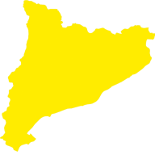
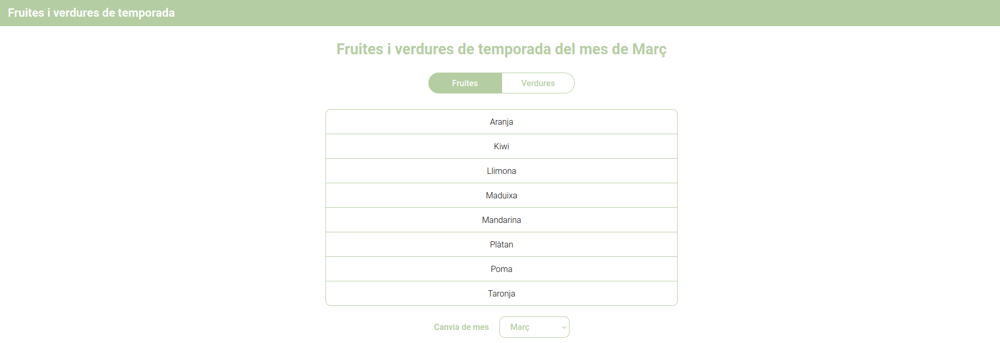

<!-- Improved compatibility of back to top link: See: https://github.com/othneildrew/Best-README-Template/pull/73 -->

<a name="readme-top"></a>

<!--
*** Thanks for checking out the Best-README-Template. If you have a suggestion
*** that would make this better, please fork the repo and create a pull request
*** or simply open an issue with the tag "enhancement".
*** Don't forget to give the project a star!
*** Thanks again! Now go create something AMAZING! :D
-->

<!-- PROJECT SHIELDS -->
<!--
*** I'm using markdown "reference style" links for readability.
*** Reference links are enclosed in brackets [ ] instead of parentheses ( ).
*** See the bottom of this document for the declaration of the reference variables
*** for contributors-url, forks-url, etc. This is an optional, concise syntax you may use.
*** https://www.markdownguide.org/basic-syntax/#reference-style-links
-->

[![LinkedIn][linkedin-shield]][linkedin-url]

<!-- PROJECT LOGO -->
<br />
<div align="center">
  <a href="https://fruites-verdures.vercel.app/">
    
  </a>

  <h3 align="center">Fruites i Verdures de temporada a Catalunya</h3>

  <p align="center">
    The frontend interface for Fruites i Verdures de temporada de Catalunya provides real-time updates on produce availability, promoting healthy eating and supporting local farmers.
    <br />
    <a href="https://fv-api-wild-star-7655.fly.dev/api/"><strong>Explore the docs »</strong></a>
    <br />
    <br />
    <a href="https://fruites-verdures.vercel.app/">Visit website</a>
    ·
    <a href="https://github.com/alex-olle/fv_client/issues">Report Bug</a>
    ·
    <a href="https://github.com/alex-olle/fv_client/issues">Request Feature</a>
  </p>
</div>

<!-- TABLE OF CONTENTS -->
<details>
  <summary>Table of Contents</summary>
  <ol>
    <li>
      <a href="#about-the-project">About The Project</a>
      <ul>
        <li><a href="#built-with">Built With</a></li>
      </ul>
    </li>
    <li>
      <a href="#getting-started">Getting Started</a>
      <ul>
        <li><a href="#installation">Installation</a></li>
      </ul>
    </li>
    <li><a href="#roadmap">Roadmap</a></li>
    <li><a href="#contact">Contact</a></li>
    <li><a href="#acknowledgments">Acknowledgments</a></li>
  </ol>
</details>

<!-- ABOUT THE PROJECT -->

## About The Project



The Fruites i Verdures de temporada de Catalunya frontend interface is a user-friendly platform that delivers timely information about the availability of fruits and vegetables in the Catalonia region for each month of the year. Designed with a focus on promoting mindful, sustainable, and local eating habits, this interface empowers users to make informed decisions about their food choices while encouraging the consumption of fresh, seasonal produce.

Objectives:

- Promote healthy and balanced eating by providing accessible information about the availability of fresh and seasonal products.
- Support local farmers by fostering the consumption of regionally grown produce.

Benefits:

- For Consumers: Enables informed decision-making regarding the purchase and consumption of fresh fruits and vegetables.
- For Farmers: Stimulates demand for local products, contributing to sustainability in agriculture.

<p align="right">(<a href="#readme-top">back to top</a>)</p>

### Built With

[![React][React.js]][React-url]

<p align="right">(<a href="#readme-top">back to top</a>)</p>

<!-- GETTING STARTED -->

## Getting Started

### Prerequisites

Run [API server](https://github.com/alex-olle/fv_api)

### Installation

1. Clone the repo
   ```sh
   git clone https://github.com/your_username_/Project-Name.git
   ```
2. Install NPM packages
   ```sh
   npm install
   ```
3. Run the project
   ```sh
   npm start
   ```

<p align="right">(<a href="#readme-top">back to top</a>)</p>

<!-- ROADMAP -->

## Roadmap

- [x] Fix vegetables bug
- [x] Add deployed API
- [x] Deploy

See the [open issues](https://github.com/alex-olle/fv_client/issues) for a full list of proposed features (and known issues).

<p align="right">(<a href="#readme-top">back to top</a>)</p>

<!-- CONTACT -->

## Contact

Àlex Ollé - [Linkedin](https://www.linkedin.com/in/alejandro-olle-ramos/)

Project Link: [Github](https://github.com/alex-olle/fv_client)

<p align="right">(<a href="#readme-top">back to top</a>)</p>

<!-- ACKNOWLEDGMENTS -->

## Acknowledgments

* [Img Shields](https://shields.io)

<p align="right">(<a href="#readme-top">back to top</a>)</p>

<!-- MARKDOWN LINKS & IMAGES -->
<!-- https://www.markdownguide.org/basic-syntax/#reference-style-links -->

[linkedin-shield]: https://img.shields.io/badge/-LinkedIn-black.svg?style=for-the-badge&logo=linkedin&colorB=555
[linkedin-url]: http://www.linkedin.com/in/alejandro-olle-ramos
[React.js]: https://img.shields.io/badge/React-20232A?style=for-the-badge&logo=react&logoColor=61DAFB
[React-url]: https://reactjs.org/
